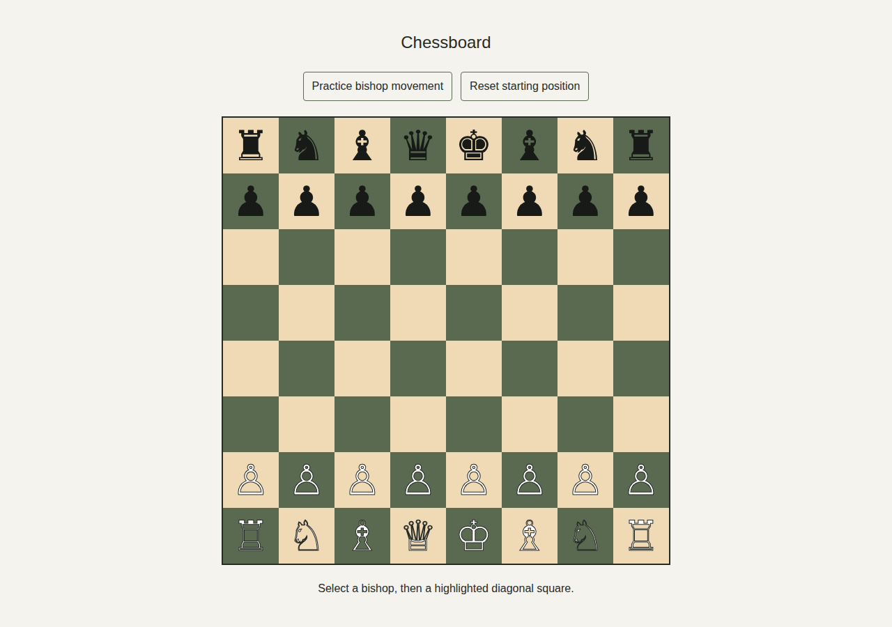
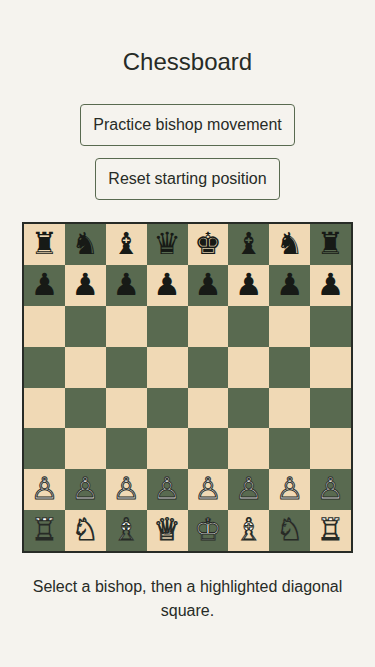
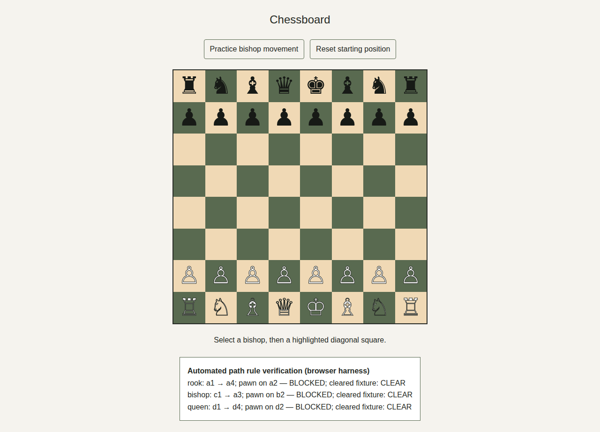
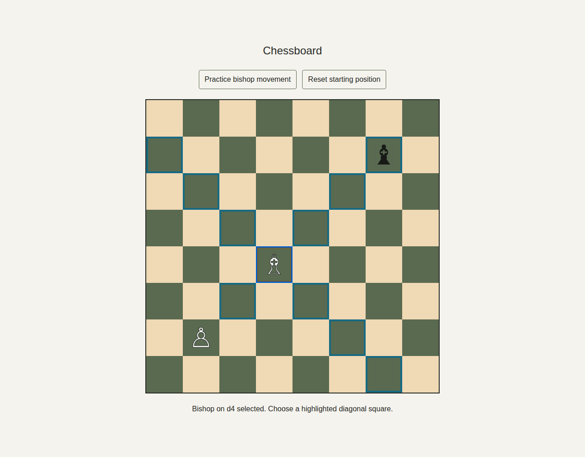
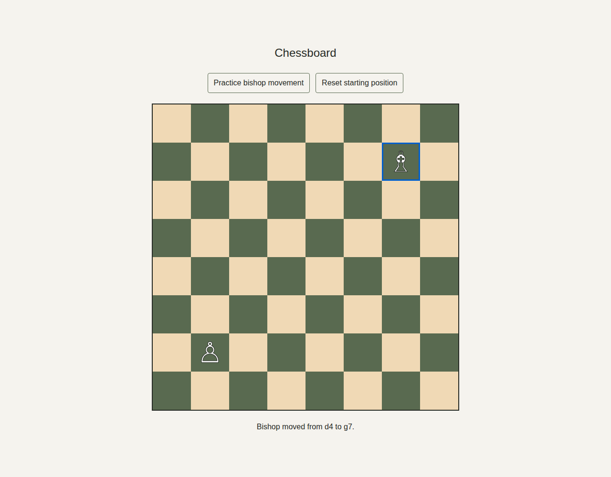

# Chessboard

A responsive 8 × 8 chessboard implementing FIDE Article 2.1: 64 equal squares alternate light and dark, with a light square at the near right corner for either player (bottom-right and top-left on screen).

Each side has the 16 pieces specified in FIDE Article 2.2: one king, one queen, two rooks, two bishops, two knights, and eight pawns, displayed in their starting positions. Pieces use the specified Unicode symbols, light/dark styling, and accessible names. Bishops can move any distance along an unobstructed diagonal, capture opposing pieces, and cannot land on friendly pieces. Select a bishop and then a highlighted destination using clicks, touch, or Tab and Enter/Space. Other pieces do not move; turns and king safety are outside this movement-only implementation.

The starting position is preserved. Use **Practice bishop movement** to open the diagonals: a white bishop on d4, a black bishop on g7, and a friendly blocker on b2. **Reset starting position** restores all 32 pieces.

`hasClearSlidingPath(type, from, to, isOccupied)` in `app/sliding-path.ts` implements the intervening-piece limitation in FIDE Article 3.5 for bishops, rooks and queens. Squares are row-major indices from 0 (a8) to 63 (h1). It rejects invalid coordinates, zero-length moves, non-sliders and incompatible directions, and returns false if any intervening square is occupied, regardless of color. Occupied endpoints do not block the path. This is a path predicate, not a complete legality check: destination ownership and captures are handled by the bishop validator; turns and king safety remain outside scope. The bishop move validator uses this shared predicate; rook and queen movement interfaces are outside this change.

## Run

Requires Node.js 22 or later and npm.

```sh
npm ci
npm run dev
```

Open http://localhost:3000.

## Verify

```sh
npm run build
npm run lint
npm run test:unit
npm run test:integration
npm run test:coverage
npx playwright install --with-deps chromium
npm run test:e2e
```

The end-to-end tests start the production server, verify piece symbols, counts, accessible names, visibility and fit, plus every square's dimensions, position and rendered color on desktop and mobile, and capture desktop and mobile screenshots. To use a locally installed Chrome, set `CHROME_PATH=/path/to/chrome`.

Path tests cover every sliding direction, origin, distance and blocker position. Integration tests use the starting board's pieces. A browser harness executes the same rule against the rendered board and cleared occupancy fixtures, and captures its results below; it does not simulate user moves.

Coverage uses c8/V8 with source maps for all application components. CI publishes measured statement, branch, function and line totals in a `coverage` Check Run using the Symphony marker and the PR head SHA.

## Screenshots

Each CI run uploads desktop and mobile PNG screenshots in the `chessboard-screenshots` artifact on its Actions run page. Local end-to-end runs write the same images to `docs/screenshots/`.







## Bishop movement proof





Mobile proof is also captured in `docs/screenshots/bishop-mobile-selected.png` and `bishop-mobile-moved.png`.
