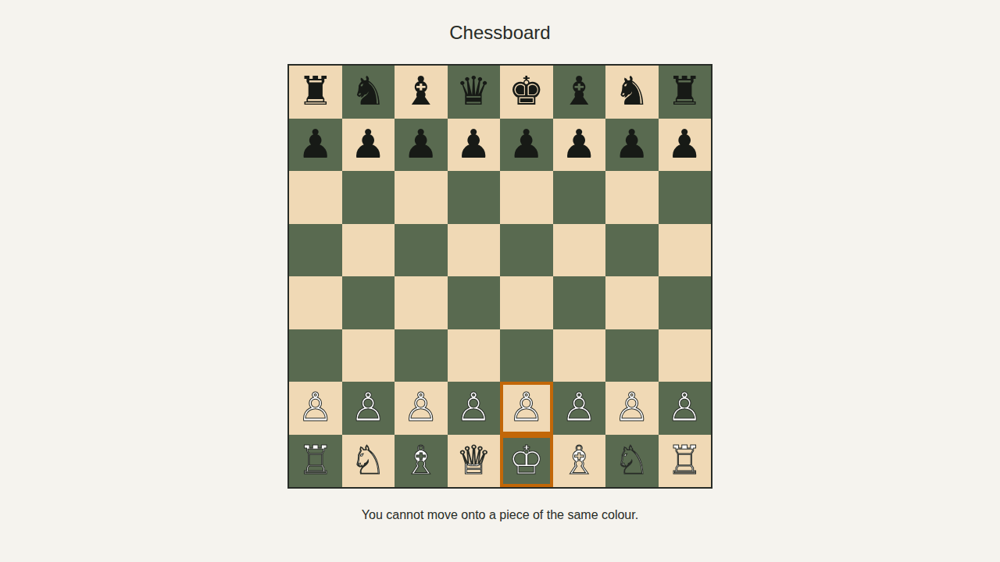
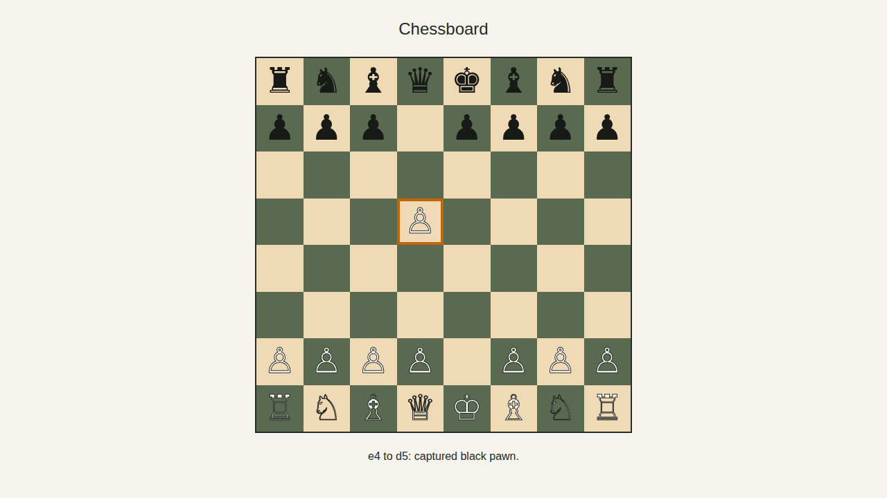
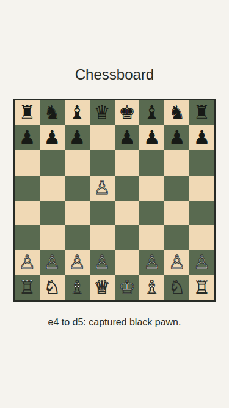

# Chessboard

A responsive 8 × 8 chessboard implementing FIDE Article 2.1: 64 equal squares alternate light and dark, with a light square at the near right corner for either player (bottom-right and top-left on screen).

Each side has the 16 pieces specified in FIDE Article 2.2: one king, one queen, two rooks, two bishops, two knights, and eight pawns, displayed in their starting positions. Pieces use the specified Unicode symbols, light/dark styling, and accessible names. Select a piece and then a destination by clicking or using Tab and Enter/Space. Selecting the same square cancels. Friendly destinations are rejected; captures remove the opponent and clear the source in one update.

Article 3.1 movement uses basic piece geometry and blocked paths. Pawns move forward and capture diagonally; attack detection includes empty diagonal squares and remains independent of king safety, including pinned pieces. Turn order, check enforcement, castling, en passant, and promotion are outside this issue; this is a movement demonstrator rather than a complete chess game.

## Run

Requires Node.js 22 or later and npm.

```sh
npm ci
npm run dev
```

Open http://localhost:3000.

## Verify

```sh
npm run build
npm run lint
npm run test:unit
npm run test:integration
npm run test:coverage
npx playwright install --with-deps chromium
npm run test:e2e
```

The end-to-end tests start the production server, verify piece symbols, counts, accessible names, visibility and fit, plus every square's dimensions, position and rendered color on desktop and mobile, and capture desktop and mobile screenshots. To use a locally installed Chrome, set `CHROME_PATH=/path/to/chrome`.

Coverage uses c8/V8 with source maps for all application components. CI publishes measured statement, branch, function and line totals in a `coverage` Check Run using the Symphony marker and the PR head SHA.

## Screenshots

Each CI run uploads desktop and mobile PNG screenshots in the `chessboard-screenshots` artifact on its Actions run page. Local end-to-end runs write the same images to `docs/screenshots/`.







