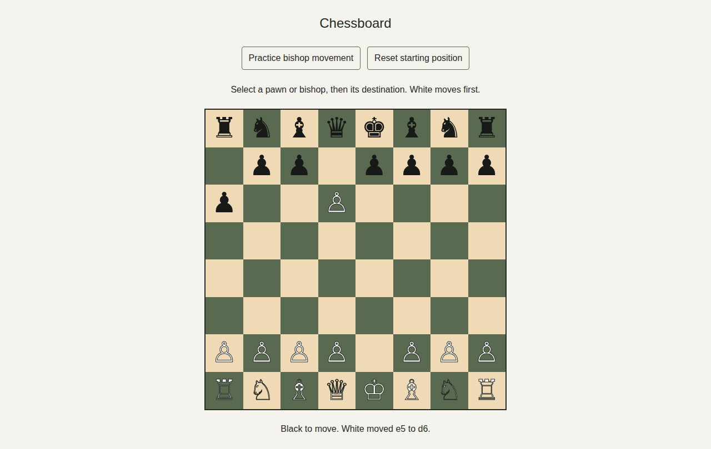
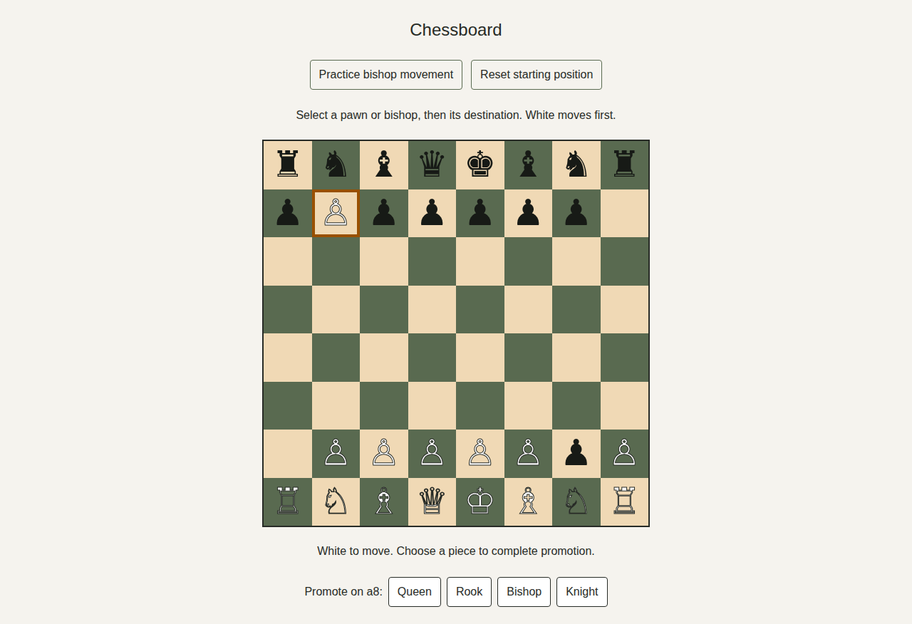
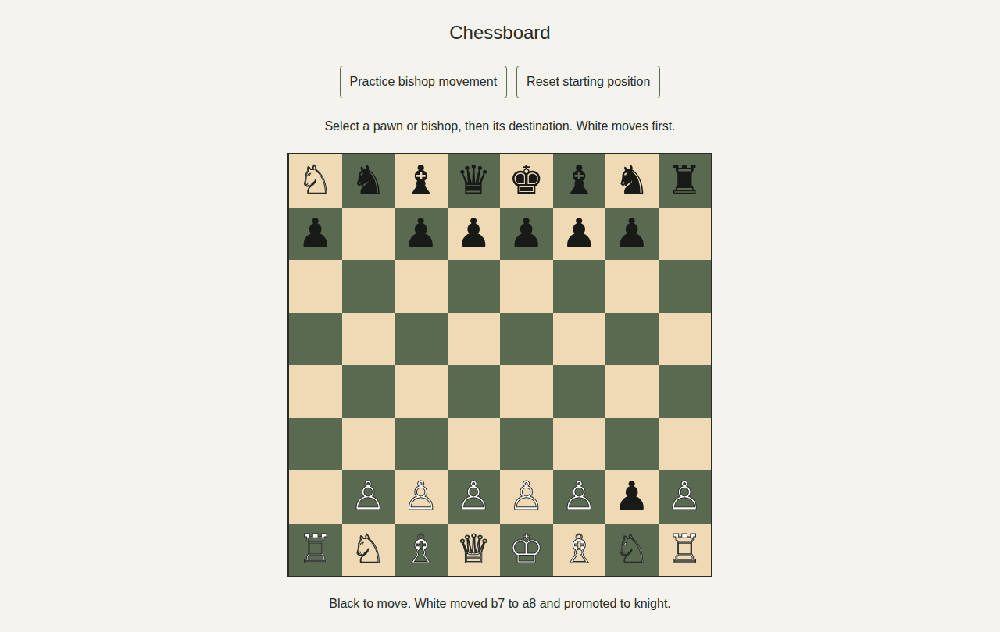

# Chessboard

A responsive 8 × 8 chessboard implementing FIDE Article 2.1: 64 equal squares alternate light and dark, with a light square at the near right corner for either player (bottom-right and top-left on screen).

Each side has the 16 pieces specified in FIDE Article 2.2: one king, one queen, two rooks, two bishops, two knights, and eight pawns, displayed in their starting positions. Pieces use the specified Unicode symbols, light/dark styling, and accessible names. Pawns implement Article 3.7: single advances, initial double advances through empty squares, diagonal captures, immediate en passant, and mandatory promotion to a queen, rook, bishop or knight of the same color.

Select a pawn or bishop and then a destination with the mouse, touch, or Tab and Enter/Space. Turns alternate starting with White. Choose a promotion piece to complete a move to the last rank. Use **Reset starting position** to restart. Bishops move along unobstructed diagonals and capture opponents; other pieces remain stationary, and check/checkmate and king-safety validation are outside this feature.

Use **Practice bishop movement** for the existing free-move bishop exercise (either color can move). Reset returns to the starting position with alternating turns.

## Run

Requires Node.js 22 or later and npm.

```sh
npm ci
npm run dev
```

Open http://localhost:3000.

## Verify

```sh
npm run build
npm run lint
npm run test:unit
npm run test:integration
npm run test:coverage
npx playwright install --with-deps chromium
npm run test:e2e
```

The end-to-end tests start the production server, verify piece symbols, counts, accessible names, visibility and fit, plus every square's dimensions, position and rendered color on desktop and mobile, exercise pawn moves, captures, en passant expiry and each promotion choice, and capture screenshots. To use a locally installed Chrome, set `CHROME_PATH=/path/to/chrome`.

Coverage uses c8/V8 with source maps for all application components and pawn rules; browser interaction coverage is exercised separately by Playwright. CI publishes measured statement, branch, function and line totals in a `coverage` Check Run using the Symphony marker and the PR head SHA.

## Screenshots

Each CI run uploads desktop and mobile PNG screenshots in the `chessboard-screenshots` artifact on its Actions run page. Local end-to-end runs write the same images to `docs/screenshots/`.









